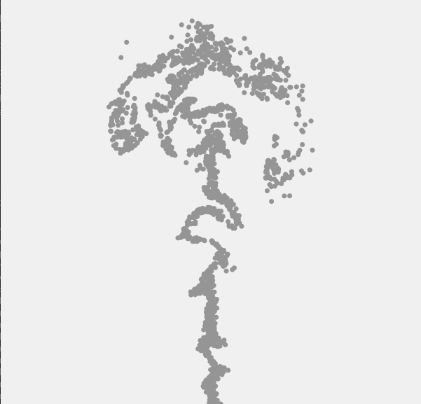
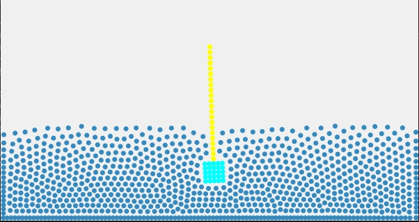
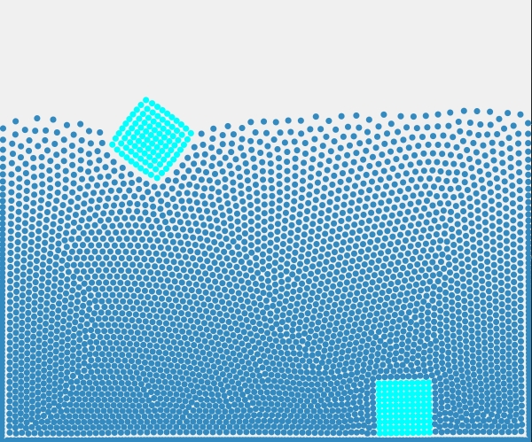

# taichi-PBF
 Position Based Fluid Simulation in Taichi

# Requirements
`
python>=3.8
taichi==0.7.31
scipy==1.10.1
`

# Features
1. Fluid Sim (water pool)
2. Smoke/Gas Sim (smoke plume rising in open area)

3. Pendulum (Rope + Rigid Body)

4. Rope
5. Rigid Body
6. Fluid + Rigid Coupling

# Control
- `1~6`: Switch Scene/Feature
- `p`: pause
- `r`: reset
- `e`: toggle fluid display
- `g`: toggle gas display
- `t`: tick one time frame when paused
- `space`: toggle gas emission
- `h`: reset postion of picked particle. Change picked particle in `include/global_settings.py`
- `left/right click`: repell/attract particles

# TODO
1. ~~Values like poly6 and spikyGradient are highly reusable and should be cached before each update~~
2. So far I store the entire grid with a giant matrix. However, many of the cells doesn't contain any particles at all, which is a huge waste of memory. A better approach would be using a dictionary and store the hash value of cell which has particles exists
3. After adding certain number of particles, the simulation will break due to the data structure capacity. There are two approaches to fix this:
- Reallocate and move data to a bigger memory when the is reached. Huge overheads when this operation happens.
- Recycle dead particles. Keep an index pool, fetch one when new particle is created, and return one when a particle dies.
